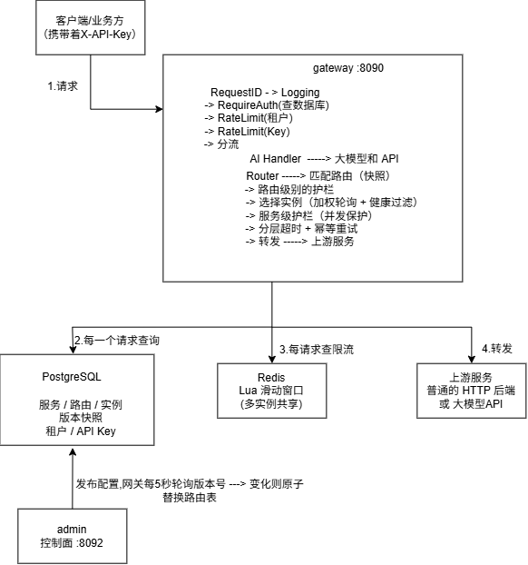

# FlowGate

> 一个基于 Go 的高性能 API 网关与流量治理系统。
> 面向内部微服务与 AI 模型服务，围绕请求转发的正确性、服务治理、故障隔离与性能可验证性构建。

---

## 目录

- [现实问题](#现实问题)
- [FlowGate 的解决方式](#flowgate-的解决方式)
- [技术栈](#技术栈)
- [系统架构图](#系统架构图)
- [目录结构](#目录结构)
- [一次请求完整链路](#一次请求完整链路)
- [配置发布流程](#配置发布流程)
- [一键运行](#一键运行)
- [故障实验](#故障实验)
- [性能测试结果](#性能测试结果)
- [已知限制](#已知限制)
- [后续计划](#后续计划)
- [参考项目与设计来源](#参考项目与设计来源)

---

## 现实问题

1. **上游偶发抖动，调用方各自处理重试**
   上游每月总有几次抖动。每个调用方都得自己决定要不要重试、重试几次、等多久。
   大多数人不会做退避 —— 上游刚恢复，一堆客户端同时重试又把它打挂。

2. **第一次请求成功、下一次失败**
   客户按文档调接口，有时成功有时失败，但错误码看不出差别。
   根因是网关把一个已经出问题的实例还留在可用列表里 —— 失败是**随机的**，
   调用方无法复现，会误判成"自己的代码有问题"。

3. **一条慢接口把整个服务拖死**
   一个数据服务上有两条接口：查用户 50ms、全表导出 10 秒。
   运营点了一次导出，30 个并发把上游的并发槽位占满，**正常的用户查询全部超时**。
   排查半小时才发现是导出打满了上游 —— 导出本身没坏，但它没有隔离。

4. **厂商密钥散落在各业务系统**
   20 多个服务都要调大模型，每家厂商的 key 各自配置。
   换一次 key 要发 20 次上线，漏一个那个服务就静默失败；
   而且无法回答"现在有几个服务在用哪个 key"。

---

## FlowGate 的解决方式

> 下表按上面的问题顺序排列 —— 「对应问题」那一列说明这个能力是为谁准备的。

| # | 能力 | 对应问题 | 说明 |
|---|---|---|---|
| 1 | **配置热更新** | — | 不可变配置快照；每 5 秒轮询版本号，变化则用 `atomic.Value` **原子替换**整张路由表，在途请求不受影响 |
| 2 | **分层超时** | ① | 建连 / 整体 / 响应头三层分开 —— 使"TCP 连不上"和"上游处理慢"不再混成同一个超时错误 |
| 3 | **幂等重试 + 退避** | ① | 只对幂等方法重试（POST 不重试，防重复扣款）；指数退避 + **保底 25% 抖动**，避免多个客户端同时重试把刚恢复的上游再次打挂 |
| 4 | **三态熔断器** | ② | 节点级 Closed / Open / HalfOpen；冷却期**惰性**转半开（省掉每节点一个定时器） |
| 5 | **主动 + 被动健康检查** | ② | `/health` 定时探测 + 请求结果反馈，把故障节点摘出可用列表 |
| 6 | **两级并发护栏** | ③ | 服务级保护上游、路由级实现隔离（一条慢接口占不满整个服务的并发）；三档策略 fail-fast / wait / drop |
| 7 | **分布式限流** | — | Redis + Lua 滑动窗口保证多实例配额一致；Redis 故障时降级到本地令牌桶（三档策略） |
| 8 | **Provider 适配层** | ④ | 厂商密钥只配在网关侧，业务系统不接触；以 OpenAI 兼容协议接入多家大模型，厂商差异由适配器抹平 |
| 9 | **SSE 流式分帧** | ④ | 网络分块不按事件边界切，需跨块重建事件边界；末尾遗漏事件要补发（否则 token 用量统计整批丢失） |
| 10 | **鉴权与配额** | ③④ | API Key 认证（SHA256 存储）+ 租户级 / Key 级双层 QPS，把配额落到具体客户 |

---

## 技术栈

| 分类 | 内容 |
|---|---|
| **语言** | Go 1.26；goroutine + channel + `sync/atomic` + `context` |
| **核心链路** | ★ **零 Web 框架** —— 转发、路由、负载均衡、熔断、重试、并发控制全部基于标准库：`net/http` + `Transport.RoundTrip`（**不用** `httputil.ReverseProxy`）、`atomic.Value` 原子替换路由表、`select` + channel 信号量、`context.WithTimeout`；SSE 分帧为自研字节级状态机 |
| **直接依赖** | 仅 5 个：`pgx/v5`（PostgreSQL）、`go-redis/v9`、`client_golang`（Prometheus）、`yaml/v2`（解析 `ai.yaml`）、`godotenv` |
| **基础设施** | PostgreSQL 16（:5433，配置 / 版本快照 / 租户 / API Key）、Redis（:6380，Lua 滑动窗口限流）、Docker Compose |
| **可观测性** | 11 个 Prometheus 指标 + `/metrics`（:9090）、`slog` JSON 日志带 `request_id`、pprof（:6060）、`/health` 白名单、SIGTERM 优雅退出 |

> ★ 依赖只有 5 个，是因为绝大部分能力没有引入第三方库 —— 这也是本项目的主要学习目标。

---

## 系统架构图



> 图片源文件在 `architecture.drawio`，可用 draw.io 打开修改后重新导出。

```
                         ┌───────────────────────────────────────────────┐
                         │                gateway  :8090                 │
   客户端 / 业务方        │               （数据面，无状态）                │
  (携带 X-API-Key)       │                                               │
        │                │   RequestID → Logging                         │
        │  ① 请求         │     → RequireAuth          ──► 查 PostgreSQL  │
        └───────────────►│     → RateLimit(租户)       ──► 查 Redis      │
                         │     → RateLimit(Key)                          │
                         │     → 分流                                    │
                         │        ├─► AI Handler ─────────► 大模型 API    │
                         │        └─► Router → 匹配路由（atomic.Value 快照）│
                         │              → 路由级护栏（Bulkhead）           │
                         │              → 选实例（加权轮询 + 健康过滤）      │
                         │              → 服务级护栏（并发保护）            │
                         │              → 分层超时 + 幂等重试              │
                         │              → 转发 ────────────► 上游服务      │
                         └───────────────────────────────────────────────┘
                                                  │
                    ② 每请求查询                   │              ③ 转发
              ┌───────────────────┬───────────────┴──────────────┐
              ▼                   ▼                              ▼
      ┌───────────────┐   ┌───────────────┐            ┌──────────────────┐
      │  PostgreSQL   │   │     Redis     │            │    上游服务        │
      │  服务 / 路由   │   │  Lua 滑动窗口  │            │  普通 HTTP 后端    │
      │  版本快照      │   │  （多实例共享） │            │  或 大模型 API     │
      │  租户 / API Key│   └───────────────┘            └──────────────────┘
      └───────▲───────┘
              │
              │  ④ 发布配置（写入新版本快照）
              │     网关每 5 秒轮询版本号 → 变化则原子替换路由表
              │
      ┌───────┴───────┐
      │     admin     │
      │  控制面 :8092  │
      └───────────────┘


  ══════════════════════════════════════════════════════════════════════════
   观测（横切所有组件，没有反向依赖）
     Prometheus 指标 :9090   ｜   slog JSON 日志（带 request_id）  ｜   pprof :6060
  ══════════════════════════════════════════════════════════════════════════
```

**图例**

| 编号 | 流向 | 说明 |
|---|---|---|
| ① | 客户端 → 网关 | 请求入口，携带 `X-API-Key` |
| ② | 网关 → PG / Redis | **每个请求都会查**：PG 做鉴权，Redis 做限流 |
| ③ | 网关 → 上游 | 普通路径走 HTTP 后端；AI 路径走 AI Handler → 大模型 API |
| ④ | admin → PG | 配置发布写入新版本快照；网关轮询版本号决定是否刷新路由表 |

>  **两条链路在网关内部分叉，但共享同一套鉴权与限流** —— 这正是"统一网关"的含义：
>
> ```
> 普通请求：分流 → Router → 路由级护栏 → 服务级护栏 → 转发
> AI 请求：分流 → AI Handler → HTTP 转发（含 SSE 流式分帧）
> ```
>
> 两者都走完整的 `RequestID → Logging → RequireAuth → RateLimit(租户) → RateLimit(Key)`。

---

## 目录结构

```
cmd/
  gateway/        数据面入口（装配 + 中间件链 + 路由刷新 + 优雅退出）
                  ai.go = AI 路由构建
  admin/          控制面入口（配置管理 API :8092）
  mock/           通用假上游（回显 + 故障注入：延迟 / 状态码 / 概率）
  mockai/         OpenAI 兼容假上游（SSE 流式 + 恶劣分片模式）
internal/
  gateway/        反向代理核心（路由匹配 + 转发编排 + 重试退避）
  loadbalance/    加权轮询 + 健康检查 + 三态熔断状态机
  middleware/     中间件链（RequestID / 日志 / 鉴权 / 限流 / 错误响应分流）
  overload/       并发护栏（三档策略 + 热更新，零依赖）
  sse/            SSE 字节级分帧器（跨块拼接 / 悬挂 CR / RESYNC / 末尾补发）
  ai/             AI 网关（模型路由 + Provider 抽象 + 流式转发）
  provider/       厂商适配器（OpenAI 兼容实现）
  ratelimit/      Redis 滑动窗口 + 本地令牌桶 + 故障降级三档
  identity/       身份模型（叶子包，零依赖）
  model/          数据模型（Service / Route / Node / Tenant / APIKey / Version）
  store/postgres/ 数据访问层（连接池 + 各表 Store + 版本快照发布）
  observability/  Prometheus 指标（11 个）
  redisclient/    Redis 客户端封装
  api/            控制面 HTTP 处理器（服务 / 节点 / 路由 / 租户 / Key / 发布）
migrations/       SQL 建表脚本（001_init.sql 含完整表结构）
tools/
  loadgen/        并发压测器（精确控制并发数与每请求超时）
  disconnect-test/ 验证「客户端断开 → 网关停止转发 → 上游停止生成」
deploy/           docker-compose（PostgreSQL 16 + Redis）
ai.yaml           AI Provider 与模型配置
```

**读代码建议从这三个零依赖的包入手**（它们不依赖项目内任何其他包，
可以独立看懂，也有单元测试）：

```
internal/overload/     并发护栏 —— 三档策略、channel 信号量、热更新
internal/sse/          SSE 分帧状态机 —— 四个字节级边界问题
internal/identity/     身份模型 —— 最简，适合先热身
```

---

## 一次请求完整链路

1. RequestID 生成唯一 ID (写进响应头 + 日志)
2. Logging 开始计时
3. RequireAuth 检验X-API-Key -> 注入身份到context
4. RateLimit(租户) 按租户配额判
5. RateLimit(Key)  按 Key 配额判
6. 分流            AI 路径 → AI Handler；其余 → Router
7. 匹配路由        从当前快照匹配 host + path + method
8. 路由级 Guard    并发护栏（入口），满了直接 503
9. 选实例          加权轮询 + 健康检查过滤 + 熔断状态过滤
10. 服务级 Guard   并发护栏（出口）
11. 分层超时 + 转发（含幂等重试 + 退避）
12. 错误分类处理   连接拒绝→502 / 超时→504 / 无健康节点→503

---

## 配置发布流程

```
① 改配置      通过 admin API 创建 / 修改服务、实例、路由
                  ↓
② 校验        发布时检查：服务是否有可用实例、路由匹配规则是否重复
                  ↓  校验失败则拒绝发布，不会污染线上配置
③ 生成快照    把当前所有配置打包成一个【不可变的版本】，
              写入 route_versions + route_version_items
                  ↓
④ 生效        网关每 5 秒轮询版本号，发现变化就用 atomic.Value
              整表原子替换路由表 —— 在途请求不受影响
                  ↓
⑤ 回滚        把历史版本重新发布为一个新版本（copy-forward），
              不删除历史记录
```

**为什么这么设计**：配置是"发一次、用很久"的东西，需要可追溯、可回滚。
用版本快照而不是"直接改表"，才能回答"线上跑的是哪一版"以及"出问题回到哪一版"。

---

## 一键运行

前置：Go 1.26+、Docker。

### 1. 启动依赖（PostgreSQL + Redis）

`deploy/docker-compose.yml` 已配好两者，以下运行命令二选一：

```powershell
# 方式一：不进目录，用 -f 指定文件
docker compose -f F:\FlowGate\deploy\docker-compose.yml up -d

# 方式二：进deploy目录（推荐，后续命令都不用带 -f）
cd F:\FlowGate\deploy
docker compose up -d
```

确认状态：`docker compose ps`（两个都应为 Up）

> 注：compose 里 Redis 未设置密码；数据库连接字符串为 `flowgate/flowgate@localhost:5433/flowgate`。

### 2. 建表

```powershell
docker cp F:\FlowGate\migrations\001_init.sql flowgate-postgres:/tmp/001_init.sql
docker exec flowgate-postgres psql -U flowgate -d flowgate -f /tmp/001_init.sql
```

> ★ 建议先把文件拷进容器再执行，不要用 `-i < 文件` 重定向 —— 避免 Windows 与控制台编码不一致导致中文注释乱码。

验证：`docker exec flowgate-postgres psql -U flowgate -d flowgate -c "\dt"` 应列出 7 张表。

### 3. 启动三个进程

 `admin` 要先于 `gateway` —— 网关启动时会立即读取"已发布的配置版本"。

```powershell
# 终端 A —— 假上游 :8091
go run ./cmd/mock -addr :8091

# 终端 B —— 管理面 :8092（先起这个）
go run ./cmd/admin

# 终端 C —— 数据面 :8090
go run ./cmd/gateway
```

> 若要验证 AI 流式链路，需再起一个：`go run ./cmd/mockai`（:8095）

> 完整的功能验证步骤（25 项，可直接照做）见 [验证清单.md](<验证清单.md>)。

---

## 故障实验

> 以下全部是**实测结果**，不是设计预期。重点是"这条在证明什么"。

| 实验 | 条件 | 结果 | 在证明什么 |
|---|---|---|---|
| **fail-fast** | `mc=1` + 上游延迟 3s + 20 并发 | `200×1` + `503×7`，**总耗时 3.0s** | ★ 不是 8×3=24s → **立即拒绝**而非排队 |
| **wait** | 同上 + `queue_timeout=500ms` | `503 queue_timeout` + `Retry-After: 1` | 被拒前**真的等过**，并告知何时重试 |
| **drop** | 同上 + 等候区容量限制 | `queue_full` 与 `queue_timeout_drop` **都出现** | 两种失败场景可区分，能指导调参 |
| **护栏覆盖重试全程** | `mc=2` + `max_retries=3` + 上游全 500，6 并发 | **在途峰值 = 2** | 写错会是 **8**（上限被放大 `maxRetries+1` 倍） |
| **Bulkhead 隔离** | 同服务两条路由，慢的 `mc=1`、服务级不限 | slow `200×1+503×7`；**fast `200×5`、耗时 8ms** | ★ 隔离的**定义性验证**（若 fast 也被拒，就只是多了一层限流） |
| **两层同时生效** | 服务和路由级都配 | 30 秒交替压测 10 轮无 hang | 固定获取顺序排除 AB-BA 死锁 |
| **客户端断开不计过载** | 10 个主动断开 vs 10 个真排队超时 | 计数 **0 vs 9** | ★ 区分"我们扛不住"和"你自己走了"（对照组排除"指标没接上"） |
| **超时 → 504** | 上游延迟 10s，`request_timeout=2000ms` | `504`，耗时 **≈2000ms** | 网关主动放弃，不是等上游返回 |
| **幂等重试 + 退避** | 上游持续 500，`max_retries=3` | 日志 `backoff_ms` **递增**，无接近 0 的值 | 保底 25% 抖动生效，防重试风暴 |
| **连接被拒 → 502** | 节点先健康、再杀掉进程 | `502` + 日志含 `connection refused` | ★ 与 503 区分（必须先健康再杀，否则验到的是熔断不是连接拒绝） |
| **熔断三态** | `cb_failure_threshold=3`，上游持续 500 | `500×3` → `503`，`circuit_state=1` | 上游明确挂掉时不再白等 |
| **配置校验** | 建同名匹配规则的路由 | `409 路由冲突`（Update 也挡） | 把**静默失效**变成显式失败 |

> 详细的实验步骤、前置配置与判读方法见 [验证清单.md](<验证清单.md>)（25 项，均可照做）。

---

## 性能测试结果

**测试条件**：本机同机压测（压测程序与网关同一台电脑），50 并发，后端为自带回显型假服务，明文 HTTP，普通请求路径（非 AI）。

| 指标 | 经网关 | 直连后端 | 网关的开销 |
|---|---|---|---|
| 吞吐 | **1505 QPS** | 37662 QPS | 慢约 25 倍 |
| P50 | **24.2 ms** | 0.7 ms | **+23.5 ms** |
| P99 | **87.7 ms** | 7.1 ms | +80.6 ms |
| 成功率 | 100% | 100% | — |

**这 23.5 毫秒是网关的"治理开销"**：鉴权（每请求查一次数据库）+ 限流（每请求问两次 Redis）。
转发本身几乎不花时间 —— 这是设计上的取舍：多花 23 毫秒，换来统一的身份与配额治理。

**两个必须说明的前提**（否则数字会被用错地方）：

```
① 数字只在【重启 gateway 后的第一轮】成立
   连续压测会逐次劣化：1505 → 931 → 480 QPS，重启后立即恢复
   已排除热降频 / 端口耗尽 / goroutine 泄漏 / 内存泄漏 / 机器负载 / 数据库故障

② 同一命令的波动可达 2.85 倍（QPS 从 664 到 1894）
   → 单次测量不足以支撑任何结论，A/B 对比必须先确认可重复性
```

**资源占用**：goroutine 16 个；内存 461 KB（三次采样完全相同，无泄漏迹象）。

> 详细测量记录、六种原因的排除过程、以及一个被推翻的错误结论，见 [压测报告.md](<压测报告.md>)。

---

## 已知限制

### 边界（这个项目**不适合**的用法）

| 限制 | 说明 |
|---|---|
| **定位是学习与验证，不是生产选型** | 生产环境请用 Nginx / Envoy / APISIX —— 它们更成熟、生态更完整 |
| **无管理界面** | 所有配置通过 admin API 操作，可用 Yaak / Postman |
| **未做控制面 / 数据面分离** | `admin` 和 `gateway` 是两个进程，但共用同一份代码仓库与配置读取逻辑 |
| **未做多租户计费** | 只有配额限制，没有用量计费后台 |
| **单实例验证** | 分布式限流支持多实例共享配额，但未做多实例集群压测 |

### 已知缺陷

| 缺陷 | 影响 | 状态 |
|---|---|---|
| **连续压测会逐次劣化** | 同一进程连压几轮后 QPS 从 1505 掉到 480，重启恢复；已排除 6 种原因，未完全定位 | 记录在 [压测报告.md](<压测报告.md>) 第四节 |
| **租户更新会清空状态** | `PUT /api/v1/tenants/{id}` 不带 `status` 时会把状态写成空串，导致该租户所有 API Key 失效（报 `API Key 无效或已停用`） | 临时方案：请求体带上 `"status":"active"` |
| **路由规则等长时优先级不明确** | 同 `host + path + match_type + methods` 的路由由主键顺序决定谁生效；已加创建/发布双重校验挡住新建，但存量数据需手工清理 | 已加防护 |

### AI 部分的范围

```
内置适配：智谱、DeepSeek（OpenAI 兼容协议）
另有 mockai 假上游，用于验证 SSE 流式与恶劣分片（不需要真实 API Key）

未做：Claude / Gemini 等非 OpenAI 协议的原生适配
```

---

## 后续计划

1. 定位"连续压测劣化"的根因（见已知缺陷）
2. 学习 LLMLite 与 New API 的框架设计，完善 AI 网关的多厂商接入
3. 性能优化：鉴权查库与两次限流 Redis 往返是当前延迟主体

---

## 参考项目与设计来源

1. Nginx
2. Envoy
3. Kong
